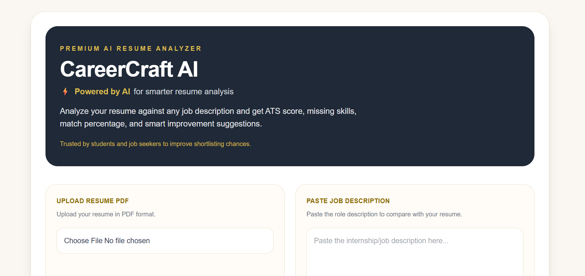
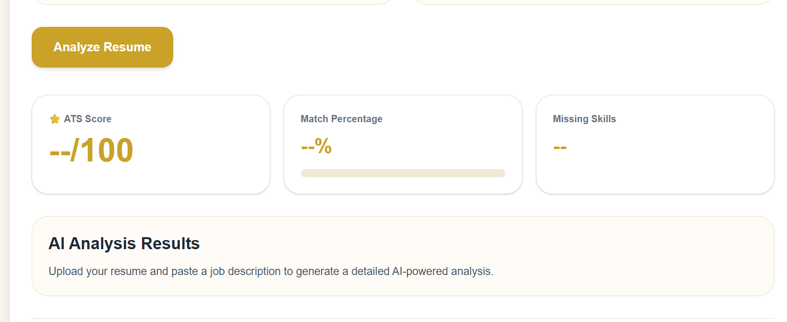

# 🚀 CareerCraft AI

> **AI-Powered ATS Resume Analyzer built with Next.js, TypeScript & Google Gemini AI**

CareerCraft AI helps students and job seekers evaluate how well their resumes match a specific job description. Simply upload your resume, paste a job description, and receive an AI-generated ATS score, match percentage, strengths, missing skills, and personalized improvement suggestions.

---

## 📸 Preview

### Home Page



### AI Analysis



---

## 🌐 Live Demo

**Live Website:** https://career-craft-qxzcfi01o-eshithareddy094-5200s-projects.vercel.app/

> Try uploading a resume PDF and compare it with any job description to receive an AI-powered ATS analysis.

## ✨ Features

* 📄 Upload Resume (PDF)
* 🤖 AI-powered Resume Analysis using Google Gemini
* 🎯 ATS Compatibility Score
* 📊 Match Percentage
* 💪 Resume Strength Detection
* ❌ Missing Skills Identification
* 💡 Personalized Improvement Suggestions
* 📥 Download Analysis Report as PDF
* 📱 Responsive Modern UI
* ⚡ Fast Next.js App Router Architecture

---

## 🛠 Tech Stack

| Technology              | Usage                 |
| ----------------------- | --------------------- |
| Next.js 16              | Frontend & API Routes |
| TypeScript              | Type Safety           |
| Tailwind CSS            | UI Styling            |
| Google Gemini 2.5 Flash | AI Resume Analysis    |
| jsPDF                   | PDF Report Generation |
| Vercel                  | Deployment            |

---

## 📂 Project Structure

```text
app/
├── api/
│   └── analyze/
│       └── route.ts
├── page.tsx
├── layout.tsx

public/

README.md
package.json
```

---

## ⚙️ How It Works

1. Upload your resume in PDF format.
2. Paste the target job description.
3. The resume is securely sent to the backend.
4. Google Gemini AI analyzes the resume against the job description.
5. The application generates:

   * ATS Score
   * Match Percentage
   * AI Summary
   * Strengths
   * Missing Skills
   * Improvement Suggestions
6. Download the analysis as a PDF report.

---

## 🚀 Getting Started

Clone the repository

```bash
git clone https://github.com/Eshithareddy41/CareerCraft-AI.git
```

Install dependencies

```bash
npm install
```

Create a `.env.local` file

```env
GEMINI_API_KEY=YOUR_GEMINI_API_KEY
```

Start the development server

```bash
npm run dev
```

Visit:

```text
http://localhost:3000
```

---

## 🔮 Future Improvements

* Resume history
* Multiple resume comparison
* Skill gap visualization
* Resume rewriting with AI
* Dark Mode
* Multi-language support
* Authentication & User Dashboard

---

## 👩‍💻 Author

**Eshitha Reddy**

---

## ⭐ Support

If you found this project useful, consider giving it a ⭐ on GitHub.
